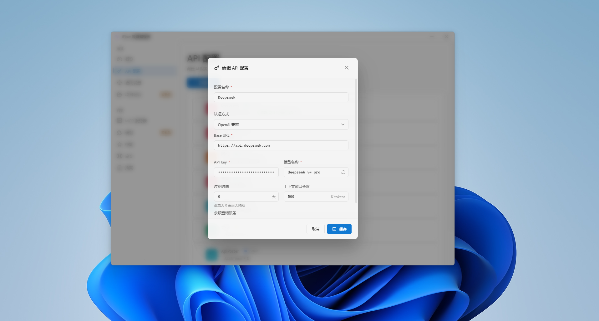

# iFlow Settings Editor

A desktop application for editing iFlow CLI configuration files.

> 🌍 Documentation: [简体中文](./README.md) | [English](./README-en.md) | [日本語](./README-ja.md)


## Features

- 📝 **API Profile Management** - Multi-environment profiles with switch, create, edit, rename, duplicate, delete, drag-to-sort, list/grid layout
- 💰 **Token Balance Query** - Auto-detect balance for Buzz/DeepSeek/Yunwu providers, custom provider rules
- 🔄 **Auto Update** - Delta update with blockMap, background silent download, one-click install
- 🖥️ **MCP Server Management** - Model Context Protocol config with stdio/SSE/streamable-http support
- ⚡ **Commands Management** - Visual command management with CRUD, import/export, category filter
- 🧩 **Skills Management** - Local ZIP and online URL import/export/delete
- 🧱 **iFlow Mod Management** - Experimental mod manager with replace/append/prepend/diff types, conflict detection
- 🎨 **Windows 11 Fluent Design** - Acrylic effect, Light/Dark/System themes
- 🌍 **Internationalization** - Simplified Chinese / English / 日本語
- 📊 **Dashboard** - Overview stats, model usage chart, quick actions
- ☁️ **Cloud Sync** - WebDAV with end-to-end encryption, multi-device sync
- 🚀 **Auto Launch** - Silent background startup (no window shown)
- 🔧 **UI Zoom** - 75%-125% scaling for different resolutions
- 📖 **Built-in Docs** - Quick start, configuration guide, examples
- 💬 **Project Sessions** - Session history viewer, search, export, token stats

## Tech Stack

| Technology | Version |
|------------|---------|
| Electron | 28.0.0 |
| Vue 3 | 3.4.0 |
| Vite | 8.0.8 |
| Pinia | 3.0.4 |
| TypeScript | 6.0.3 |
| vue-i18n | 11.4.5 |
| Less | 4.6.4 |
| Vitest | 4.1.4 |
| electron-builder | 24.13.3 |
| electron-updater | 6.8.3 |

## Supported Systems

- Windows 10 / 11 (x64)
- macOS 12+ (x64 / arm64)

## Installation

### Run from Source

```bash
git clone https://github.com/yuentao/iFlow-Settings-Editor-GUI.git
cd iFlow-Settings-Editor-GUI
npm install
npm run electron:dev
```

### Build Installers

```bash
npm run build:win           # Windows x64
npm run build:win-portable  # Portable version
npm run build:mac           # macOS x64 + arm64
```

Builds are placed in the `release/` directory.

### Dev Commands

```bash
npm run electron:dev  # Dev mode
npm run type-check    # TypeScript check
npm run lint          # ESLint
npm run format        # Prettier
npm run check         # Full check
npm run test:run      # Tests
```

## Usage Guide

### General Settings


Configure language, theme, acrylic effect, UI zoom, CLI behavior (token limits, approval mode, thinking mode, tool exclusion), log level, auto-update, cloud sync, and more.

### API Profile Management


- Create/edit/switch/rename/duplicate/delete API profiles
- List/grid layout modes with drag-to-sort
- Auto-fetch models from API endpoint
- Token balance display (Buzz/DeepSeek/Yunwu + custom)
- Real-time connectivity monitoring



### MCP Server Management


Configure stdio/SSE/streamable-http MCP servers with environment variables, quick-add via JSON/CLI.

### Skills Management


Import from local ZIP or GitHub URL, export and delete skills.

### Commands Management


Full CRUD for iFlow commands with category filtering and JSON import/export.

### iFlow Mod Management


Experimental mod system - replace/append/prepend/diff types with conflict detection.
- **Packing tool** - Use [iFlow-Mod-Builder](https://github.com/yuentao/iFlow-Mod-Builder) to visually package `.iflow-mod` files.

### Project Sessions


View session history with search, export (MD/JSON), and token usage stats.

### Docs Viewer


Built-in quick start, configuration guide, and usage examples.

### Cloud Sync


WebDAV-based sync with end-to-end encryption, device management, and password protection.

### System Tray


Minimize to tray with quick API profile switching.

## Configuration

```
~/.iflow/settings.json
```

Auto-backup creates `settings.json.bak` on each save.

## Testing

```bash
npm run test          # Watch mode
npm run test:run      # Single run
npm run test:coverage # Coverage report
```

## License

MIT License

## Contact

- Company: 上海潘哆呐科技有限公司
- Repository: https://github.com/yuentao/iFlow-Settings-Editor-GUI
