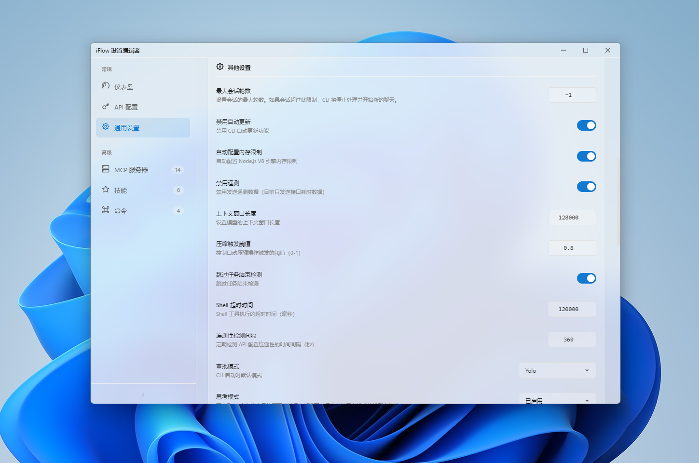
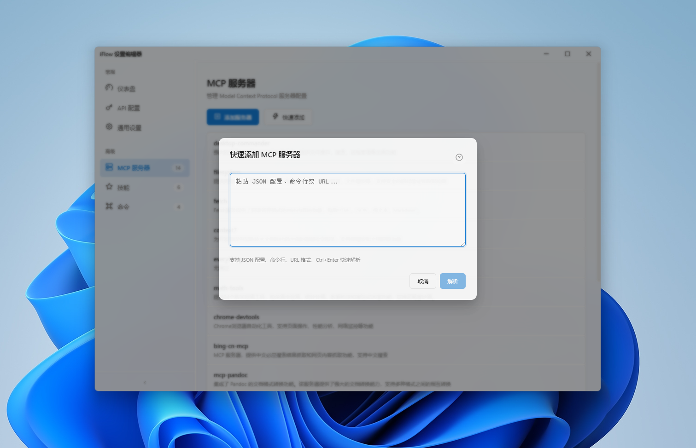
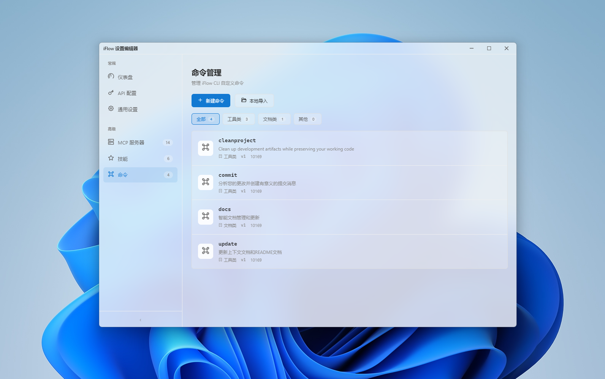
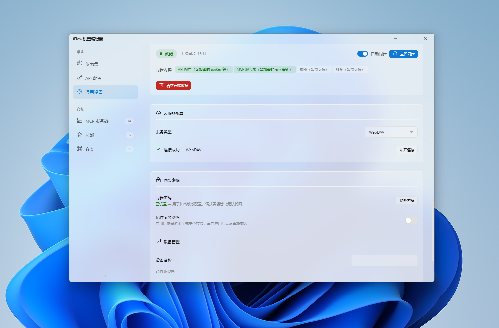

# iFlow Settings Editor

iFlow CLI 設定ファイルを編集するためのデスクトップアプリケーション。

> 🌍 ドキュメント言語： [简体中文](./README.md) | [English](./README-en.md) | [日本語](./README-ja.md)


## 機能特性

- 📝 **API プロファイル管理** - 複数環境プロファイルの切り替え、作成、編集、名前変更、複製、削除、ドラッグ並べ替え
- 🔄 **自動更新チェック** - 起動時の自動更新チェック、手動チェック対応、ダウンロード進捗リアルタイム表示、いつでもキャンセル可能
- 📥 **バックグラウンドダウンロード** - 更新をバックグラウンドで静かにダウンロード、設定ページで進捗リアルタイム表示、完了後ワンクリックインストール
- 🖥️ **MCP サーバー管理** - Model Context Protocol サーバーの便利な設定インターフェース
- ⚡ **コマンド管理** - iFlow コマンドを視覚的に管理、作成、編集、削除、インポート/エクスポート、カテゴリフィルタリング対応
- 🎨 **Windows 11 デザイン** - Fluent Design 仕様に準拠したインターフェース
- 🌈 **マルチテーマ** - Light / Dark / System (システム追随) 3 つのテーマ
- 🌍 **国際化** - 简体中文、English、日本語対応
- 💧 **アクリルエフェクト** - 調整可能な透明度の現代的な視覚効果
- 🧩 **スキル管理** - ローカルおよびオンラインでの iFlow スキルのインポート、エクスポート、削除
- 📦 **システムトレイ** - トレイへの最小化、API プロファイルのクイック切り替え
- 🚀 **自動起動** - システム起動と同時に起動、常にサイレントモードで実行（ウィンドウ表示なし）
- 📊 **ダッシュボードビュー** - 現在の設定状態とクイックアクションを直感的に表示
- ☁️ **クラウド同期** - WebDAV プロトコルによるクラウド設定同期、エンドツーエンド暗号化でデータ安全保護、マルチデバイス間シームレス同期
- 🔧 **TypeScript 型安全** - 完全な TypeScript 移行、包括的な型推論とコンパイル時チェックを提供
- 🧱 **モジュール化アーキテクチャ** - メインプロセスのモジュール化リファクタリング、コード構造がよりクリアで保守性向上
- 🧪 **包括的なテストカバレッジ** - コンポーネントと Store のユニットテストをフルカバレッジ、機能の安定性と信頼性を確保
- ✅ **統一バリデーションフレームワーク** - 一貫したフォームバリデーションとエラーハンドリング機構
- ⚙️ **CLI 動作制御** - CLI ランタイムの各项動作を細かく制御（メモリ表示、セッション制限、ツール除外、承認モードなど）

## 技術スタック

| 技術 | バージョン |
|------|-----------|
| Electron | 28.0.0 |
| Vue | 3.4.0 |
| Vite | 8.0.8 |
| vue-i18n | 9.14.5 |
| Pinia | 3.0.4 |
| TypeScript | 6.0.3 |
| Less | 4.6.4 |
| Vitest | 4.1.4 |
| electron-builder | 24.13.3 |
| @icon-park/vue-next | 1.4.2 |
| @vueuse/core | 14.2.1 |
| @iarna/toml | 2.2.5 |
| fast-xml-parser | 5.7.2 |
| marked | 18.0.2 |
| adm-zip | 0.5.17 |
| electron-log | 5.4.3 |
| electron-updater | 6.8.3 |

## 対応システム

- Windows 10 / 11 (x64)
- macOS 12+ (x64 / arm64)

## インストール

### ソースから実行

```bash
# リポジトリをクローン
git clone https://git.pandorastudio.cn/product/iFlow-Settings-Editor-GUI.git

# ディレクトリに移動
cd iFlow-Settings-Editor-GUI

# 依存関係をインストール
npm install

# 開発モードで実行
npm run electron:dev
```

### インストーラーのビルド

```bash
# Windows インストーラーのビルド (x64)
npm run build:win

# ポータブル版のビルド
npm run build:win-portable

# NSIS インストーラーのビルド
npm run build:win-installer

# macOS インストーラーのビルド (x64 + arm64)
npm run build:mac

# macOS 特定アーキテクチャのみのビルド
npm run build:mac64   # x64 のみ
npm run build:mac-arm # arm64 のみ

# macOS DMG イメージのビルド
npm run build:mac-dmg

# macOS ZIP アーカイブのビルド
npm run build:mac-zip
```

ビルド完了後、インストーラーは `release/` ディレクトリに配置されます。

### 開発コマンド

```bash
# TypeScript 型チェック
npm run type-check

# 開発モード (Vite Dev Server)
npm run dev

# Electron 開発モード (Vite + Electron 並行起動)
npm run electron:dev
```

### CI/CD

プロジェクトは GitHub Actions を使用して継続的インテグレーションとリリースを行います：

- **タグプッシュ** `v*` で自動ビルドし GitHub Release を作成
- Windows (x64) および macOS (x64/arm64) のマルチプラットフォームビルドをサポート
- CHANGELOG.md を自動抽出してリリースノート生成

```bash
# リリースをトリガー
git tag v1.9.0
git push origin v1.9.0
```

## 使用方法

### 一般設定


「一般設定」ページで以下の設定が可能：

#### 基本設定
- **言語** - インターフェース表示言語（简体中文 / English / 日本語）
- **テーマ** - ビジュアルテーマ（Light / Dark / System）
- **メモリ使用量表示** - ステータスバーに CLI メモリ使用量を表示
- **バナー非表示** - CLI 起動時のウェルカムバナーを非表示
- **アクリルエフェクト** - ウィンドウ背景の透明度を調整（0-100%）

#### 自動起動
- **自動起動** - アプリのシステム起動時の自動実行制御（有効時は常にサイレントモードで実行、ウィンドウ表示なし）

#### その他の設定
- **最大セッション数** - 会話の最大ターン数を制限
- **自動更新無効** - 自動更新チェックを無効化
- **メモリ制限自動設定** - システムメモリに基づいて Node.js V8 ヒープサイズを自動調整
- **テレメトリ無効** - 使用データ収集を無効化
- **トークン制限** - リクエストごとのトークン上限を設定
- **圧縮トークンしきい値** - 自動圧縮のトリガーとなるトークン比率を設定（0-1）
- **次のスピーカーチェックをスキップ** - 連続同一スピーカーを許可
- **シェルタイムアウト** - コマンド実行のタイムアウト時間（秒）
- **接続ポーリング間隔** - ネットワーク接続チェック間隔（秒）
- **承認モード** - コマンド実行承認戦略のデフォルト設定（yolo/plan/autoEdit/default）
- **思考モード有効** - AI が最終回答前に内部推論を実行するモードを有効化（思考モード対応モデルのみ）
- **ツール除外** - CLI から除外するコアツール名のリストを指定；ShellTool(rm -rf) のようなコマンド固有の制限もサポート
  

#### このアプリについて
- **バージョン情報** - 現在のアプリバージョンと著作権情報を表示
- **更新の手動チェック** - クリックして新バージョンを即時チェック（ダウンロード進捗リアルタイム表示、キャンセル可能）
- **自動更新** - 自動更新チェックのオン/オフ（バックグラウンドダウンロード、完了後ワンクリックインストール）

### API プロファイル管理


「API 設定」ページでは以下が可能：

- **プロファイル切り替え** - 異なるプロファイルをクリックして素早く切り替え
- **新規プロファイル作成** - 新しい API 環境設定を作成
  
- **設定編集** - プロファイル名、認証タイプ、API Key、Base URL、モデル名などを変更；API から利用可能なモデルリストの自動取得をサポート
- **プロファイル名変更** - プロファイルの新しい名前を設定（現在使用中のプロファイルは改名不可）
- **プロファイル複製** - 既存プロファイルをコピーして新規作成
- **ドラッグ並べ替え** - プロファイルをドラッグして表示順序を調整
- **プロファイル削除** - 不要なプロファイルを削除（デフォルトプロファイルは削除不可）

対応認証タイプ：
- API Key
- OpenAI Compatible

### MCP サーバー管理


「MCP サーバー」ページでは以下が可能：

- **サーバー追加** - 新しい MCP サーバーを設定（stdio、sse、streamable-http 転送タイプ対応）
  
- **サーバー編集** - サーバー名、説明、コマンド、引数、環境変数などを変更
  
- **サーバー削除** - 不要なサーバーを削除
- **クイック追加** - JSON、コマンドライン、URL テキストを貼り付けて MCP サーバーを一括追加（自動解析と重複排除）
- **環境変数設定** - 各サーバーごとに独立した環境変数を設定

対応転送タイプ：
- **stdio** - 標準入出力モード（ローカルプロセス）
- **sse** - Server-Sent Events モード（HTTP サービス）
- **streamable-http** - ストリーミング HTTP モード

### スキル管理


「スキル」ページでは以下が可能：

- **ローカルインポート** - ローカルの ZIP アーカイブからスキルをインポート
- **オンラインインポート** - GitHub URL からスキルをインポート
- **スキルエクスポート** - スキルを指定ディレクトリにエクスポート
- **スキル削除** - 不要なスキルを削除

### コマンド管理



「コマンド」ページでは以下が可能：

- **コマンド一覧** - すべての利用可能な iFlow コマンドを表示、カテゴリフィルタリング対応（utility、documentation、other）
- **コマンド作成** - エディタダイアログで新しいカスタムコマンドを作成
- **コマンド編集** - コマンド名、説明、カテゴリ、バージョン、作成者、プロンプトを変更
- **コマンドエクスポート** - コマンドを JSON ファイルとしてローカルにエクスポート
- **コマンド削除** - 不要なコマンドを削除
- **コマンドインポート** - ローカルの JSON ファイルからコマンドをインポート

コマンドエディタは以下のフィールドをサポート：
- **名前** - コマンド一意識別子（英字、数字、アンダースコア、ハイフン）
- **説明** - コマンド機能説明
- **カテゴリ** - カテゴリラベル（utility/documentation/other）
- **バージョン** - コマンドバージョン番号
- **作成者** - 作成者情報（任意）
- **プロンプト** - コマンドの具体的な内容または指示

コマンドは JSON 形式で保存され、柔軟な管理と共有が可能。

### クラウド同期管理



「クラウド同期」ページでは以下が可能：

- **WebDAV サーバー設定** - サーバー URL、ユーザー名、パスワードなどを入力
- **接続テスト** - WebDAV サーバーの接続性と権限を検証
  
- **手動同期** - 「今すぐ同期」ボタンをクリックしてローカル設定をクラウドにアップロードまたはクラウドからダウンロード
- **自動同期** - 設定変更時に自動的にクラウドへ同期する機能を有効化
- **同期状態表示** - 最終同期時間、同期エラーなどをリアルタイム表示
- **クラウドデータクリア** - クラウドに保存されたすべての設定データをワンクリックでクリア
- **デバイス管理** - 同期済みデバイスリストの表示と管理
- **パスワード保護** - 同期パスワードを設定し、エンドツーエンド暗号化によるデータセキュリティを確保

**同期対象**：現在は API プロファイルと MCP サーバーの同期をサポート；スキルとコマンドは今後対応予定。

**セキュリティ設計**：
- すべての同期データはクライアント側で暗号化されてからアップロード
- タイムスタンプベースのインテリジェントな差分マージ
- フィールドレベルのディープマージで両方の変更を保持
- トームストーン機構により削除済みアイテムの復活を防止

### システムトレイ


- ウィンドウを閉じるとアプリがシステムトレイに最小化（終了しない）
- トレイアイコンをダブルクリックするとメインウィンドウを表示
- トレイ右クリックメニューで API プロファイルをクイック切り替え

## 設定ファイル

アプリケーション設定ファイルは以下にあります：

```
~/.iflow/settings.json
```

保存時には自動的にバックアップファイル `settings.json.bak` が生成されます。

## テスト

プロジェクトはテストフレームワークとして **Vitest 4.x** を使用し、DOM テスト環境に **happy-dom** を採用しています。

```bash
# テスト実行（ウォッチモード）
npm run test

# UI テストモード（ビジュアルインターフェース）
npm run test:ui

# テストカバレッジレポート
npm run test:coverage

# 単発実行（CI モード）
npm run test:run
```

### テストカバレッジ

- **コンポーネントテスト**：TitleBar, SideBar, InputDialog, MessageDialog, ApiProfileDialog, ServerPanel, EmptyState, SkeletonLoader, UpdateNotification, UpdateProgress など
- **ビューテスト**：GeneralSettings, ApiConfig, McpServers, SkillsView, Dashboard など
- **Store テスト**：settings, apiProfiles, skills, commands 各状態管理モジュール
- **ユニットテスト**：ユーティリティ、コンポーザブル、型定義など

テストファイルはソースファイルと同じディレクトリに配置され、`*.test.js` または `*.test.ts` という命名です。

## プロジェクト構成

```
iFlow-Settings-Editor-GUI/
├── main.js              # Electron メインプロセスエントリ
├── preload.js           # プリロードスクリプト
├── index.html           # エントリー HTML
├── vite.config.js       # Vite 設定
├── vitest.config.js     # Vitest 設定
├── tsconfig.json        # TypeScript 設定
├── build/               # ビルド資材
├── dist/                # Vite ビルド出力
├── release/             # Electron Builder 出力
├── screenshots/         # アプリケーションスクリーンショット
└── src/
    ├── main.js          # Vue エントリ
    ├── App.vue          # ルートコンポーネント
    ├── components/      # 共通コンポーネント
    │   ├── TitleBar.vue        # タイトルバー
    │   ├── SideBar.vue         # サイドナビゲーション
    │   ├── InputDialog.vue     # 入力ダイアログ
    │   ├── MessageDialog.vue   # メッセージダイアログ
    │   ├── ApiProfileDialog.vue # API プロファイルダイアログ
    │   ├── ServerPanel.vue     # サーバー編集パネル
    │   ├── CommandEditorDialog.vue # コマンドエディタダイアログ
    │   ├── EmptyState.vue      # 空状態コンポーネント
    │   ├── SkeletonLoader.vue  # スケルトンローダー
    │   ├── UpdateNotification.vue # 更新通知
    │   └── UpdateProgress.vue  # 更新進捗
    ├── composables/     # Vue コンポーザブル
    │   ├── useLocale.ts        # i18n フック
    │   └── useSettings.ts      # 設定フック
    ├── views/           # ページビュー
    │   ├── GeneralSettings.vue # 一般設定
    │   ├── ApiConfig.vue      # API 設定
    │   ├── McpServers.vue     # MCP サーバー管理
    │   ├── SkillsView.vue     # スキル管理
    │   ├── CommandsView.vue   # コマンド管理
    │   └── Dashboard.vue      # ダッシュボード
    ├── main/            # Electron メインプロセスモジュール
    │   ├── index.js           # メインプロセスエントリ
    │   ├── constants.js       # 定数定義
    │   ├── window.js          # ウィンドウ管理
    │   ├── tray.js            # トレイ管理
    │   ├── ipc/               # IPC ハンドラー
    │   │   ├── apiProfiles.js # API 設定 IPC
    │   │   ├── commands.js    # コマンド IPC
    │   │   ├── dialogs.js     # ダイアログ IPC
    │   │   ├── index.js       # IPC アグリゲータ
    │   │   ├── settings.js    # 設定 IPC
    │   │   ├── skills.js      # スキル IPC
    │   │   ├── updates.js     # 更新 IPC
    │   │   └── cloud.js       # クラウド同期 IPC
    │   ├── services/          # メインプロセスサービス
    │   │   ├── autoLaunchService.js # 自動起動サービス
    │   │   ├── configService.js # 設定サービス
    │   │   └── cloud/         # クラウド同期サービス
    │   │       └── WebDAVProvider.js # WebDAV アダプタ
    │   └── utils/             # ユーティリティ
    │       ├── errors.js      # エラー定義
    │       ├── logger.js      # ロガー
    │       ├── translations.js # 翻訳ユーティリティ
    │       └── validator.js   # バリデータ
    ├── stores/          # Pinia 状態管理 (TypeScript)
    │   ├── apiProfiles.ts     # API プロファイル状態
    │   ├── commands.ts        # コマンド状態
    │   ├── settings.ts        # 設定状態
    │   ├── skills.ts          # スキル状態
    │   ├── cloudSync.ts       # クラウド同期状態
    │   ├── ui.ts              # UI 状態
    │   └── index.js           # Store アグリゲータ
    ├── locales/         # 国際化言語パック
    │   ├── en-US.js    # 英語
    │   ├── index.js    # 中国語（簡体字）
    │   └── ja-JP.js    # 日本語
    ├── styles/          # グローバルスタイル
    │   └── global.less # Windows Fluent Design スタイル
    └── shared/          # 共有型定義
        └── types.ts    # TypeScript 型宣言
```

## ライセンス

MIT License

## お問い合わせ

- 会社: 上海潘哆呐科技有限公司
- リポジトリ: https://git.pandorastudio.cn/product/iFlow-Settings-Editor-GUI
