# iFlow Settings Editor

iFlow CLI 設定ファイルを編集するためのデスクトップアプリケーション。

> 🌍 ドキュメント言語： [简体中文](./README.md) | [English](./README-en.md) | [日本語](./README-ja.md)

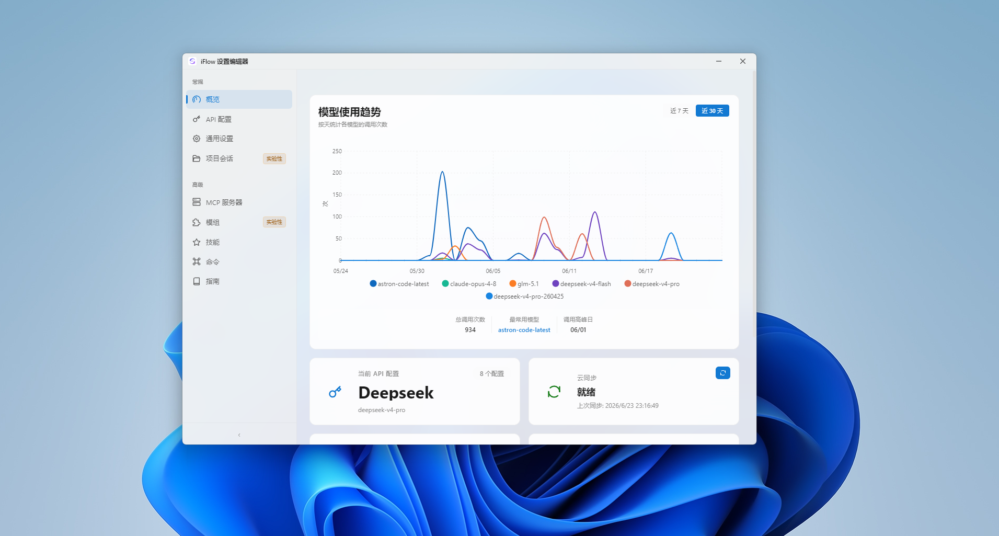

## 機能特性

- 📝 **API プロファイル管理** - 複数環境プロファイル、一覧/グリッドレイアウト、ドラッグ並べ替え
- 💰 **Token 残高照会** - Buzz/DeepSeek/雲霧プロバイダ対応、カスタムルール
- 🔄 **自動更新** - 差分更新（blockMap）、バックグラウンドダウンロード、ワンクリックインストール
- 🖥️ **MCP サーバー管理** - stdio/SSE/streamable-http 対応
- ⚡ **コマンド管理** - CRUD、カテゴリフィルタ、JSON インポート/エクスポート
- 🧩 **スキル管理** - ZIP/GitHub URL からインポート、エクスポート、削除
- 🧱 **iFlow Mod 管理** - 実験的モッド管理、衝突検出
- 🎨 **Windows 11 Fluent Design** - アクリル効果、Light/Dark/System テーマ
- 🌍 **国際化** - 简体中文 / English / 日本語
- 📊 **ダッシュボード** - 統計、モデル使用傾向グラフ
- ☁️ **クラウド同期** - WebDAV、エンドツーエンド暗号化
- 🔧 **UI ズーム** - 75%-125% スケーリング
- 📖 **内蔵ドキュメント** - クイックスタート、設定ガイド
- 💬 **プロジェクトセッション** - 履歴表示、検索、エクスポート、Token 統計

## 技術スタック

| 技術 | バージョン |
|------|-----------|
| Electron | 28.0.0 |
| Vue 3 | 3.4.0 |
| Vite | 8.0.8 |
| Pinia | 3.0.4 |
| TypeScript | 6.0.3 |
| vue-i18n | 11.4.5 |
| Less | 4.6.4 |
| Vitest | 4.1.4 |
| electron-builder | 24.13.3 |
| electron-updater | 6.8.3 |

## 対応システム

- Windows 10 / 11 (x64)
- macOS 12+ (x64 / arm64)

## インストール

### ソースから実行

```bash
git clone https://github.com/yuentao/iFlow-Settings-Editor-GUI.git
cd iFlow-Settings-Editor-GUI
npm install
npm run electron:dev
```

### インストーラービルド

```bash
npm run build:win           # Windows
npm run build:win-portable  # ポータブル版
npm run build:mac           # macOS
```

`release/` ディレクトリに出力されます。

## 使い方

### 一般設定

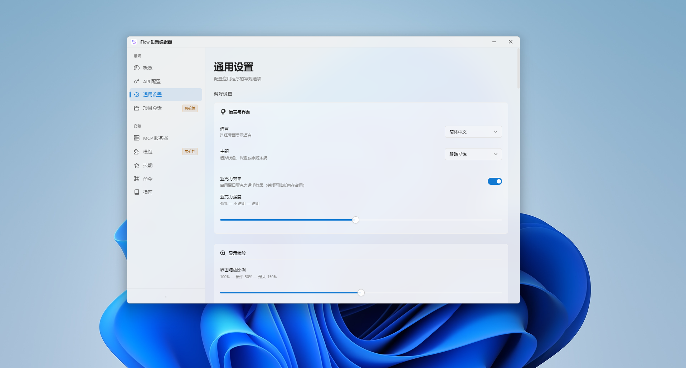

言語、テーマ、アクリル効果、UI ズーム、CLI 動作制御（Token制限、承認モード、ログレベル）、自動更新、クラウド同期などを設定。

### API プロファイル管理

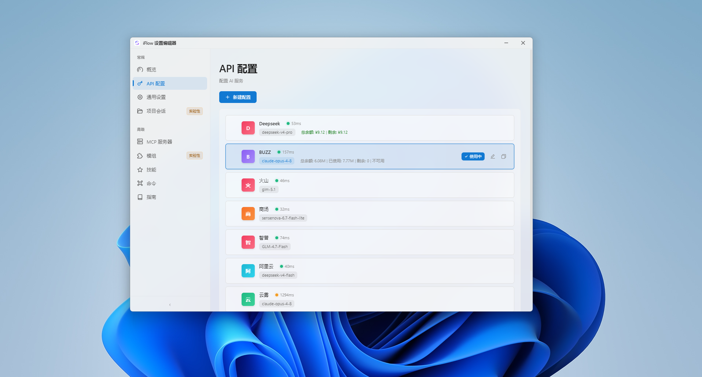

プロファイルの作成/編集/切替/複製/削除、一覧/グリッドレイアウト、モデル自動取得、残高照会。

### MCP サーバー管理

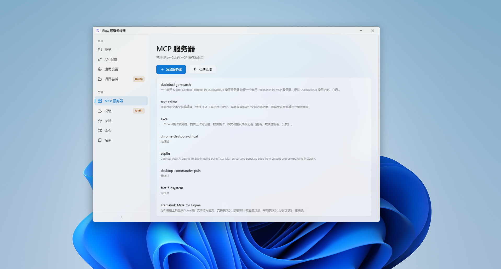

stdio/SSE/streamable-http サーバーの設定、環境変数、クイック追加。

### スキル管理

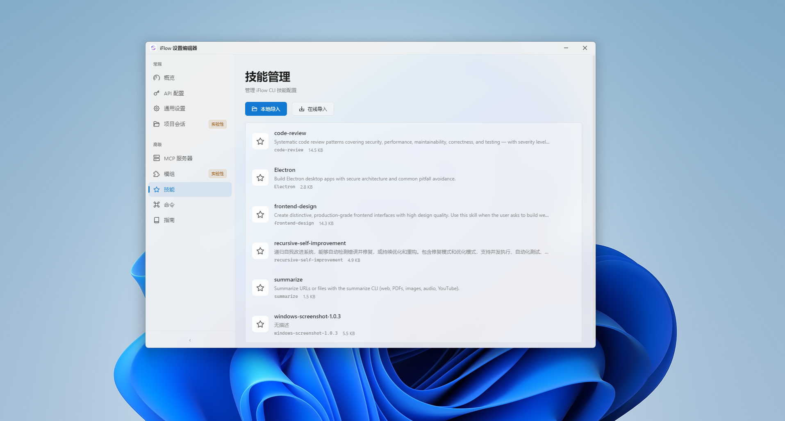

ZIP/GitHub URL からのインポート、エクスポート、削除。

### コマンド管理

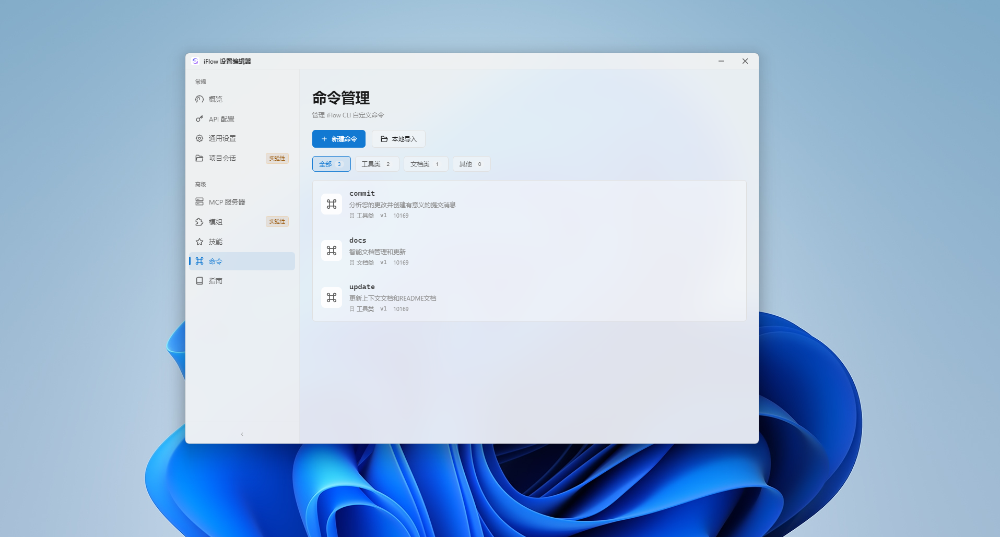

CRUD、カテゴリフィルタ、JSON インポート/エクスポート。

### iFlow Mod 管理

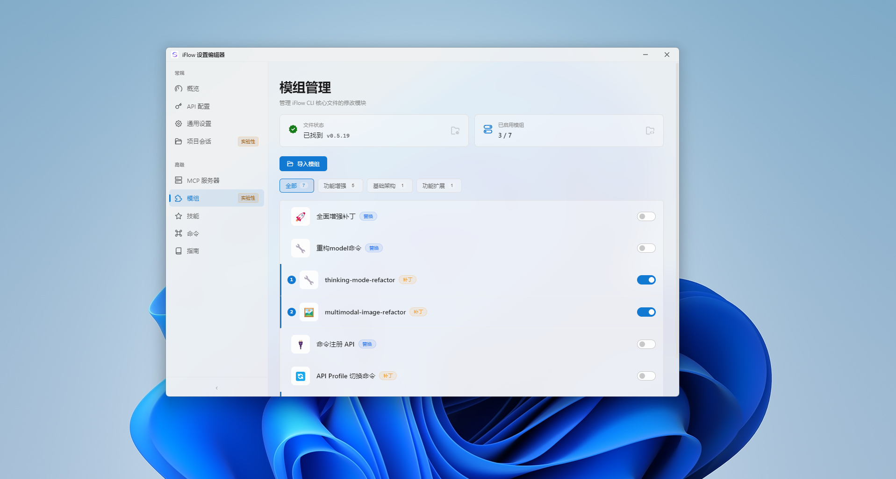

実験的 Mod 管理 - replace/append/prepend/diff タイプ、衝突検出。
- **パッケージ化ツール** - [iFlow-Mod-Builder](https://github.com/yuentao/iFlow-Mod-Builder) で `.iflow-mod` ファイルをビジュアルパッケージ化

### プロジェクトセッション

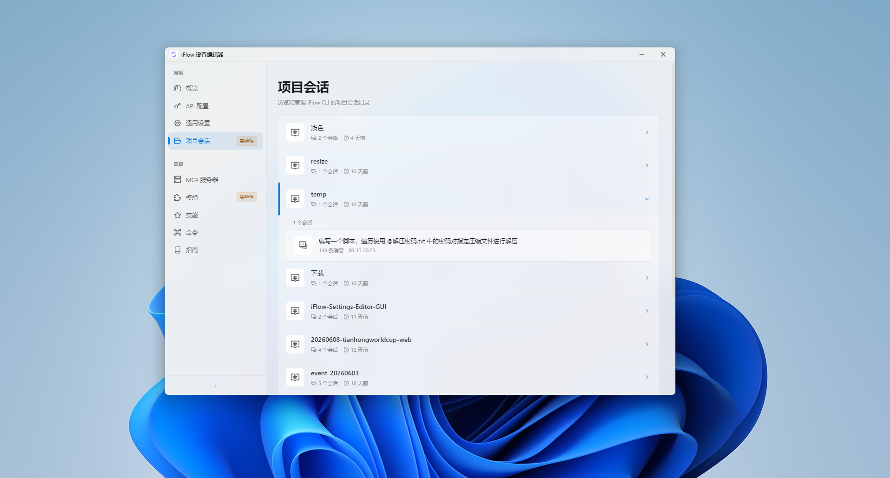

セッション履歴の表示、検索、エクスポート、Token 統計。

### ドキュメント

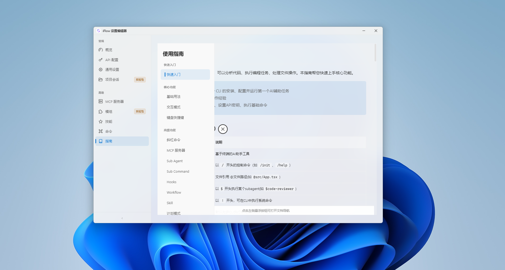

クイックスタート、設定ガイド、使用例。

### クラウド同期

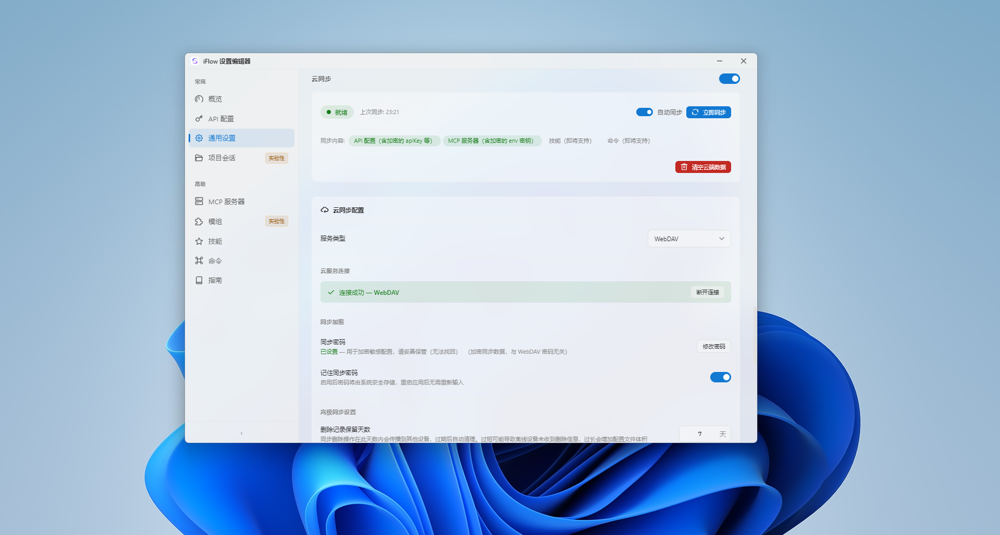

WebDAV 同期、エンドツーエンド暗号化、デバイス管理。

### システムトレイ

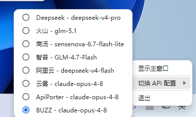

トレイに最小化、API プロファイルのクイック切替。

## 設定ファイル

```
~/.iflow/settings.json
```

保存時に `settings.json.bak` が自動生成されます。

## テスト

```bash
npm run test          # ウォッチモード
npm run test:run      # 単発実行
npm run test:coverage # カバレッジ
```

## ライセンス

MIT License

## お問い合わせ

- 会社：上海潘哆呐科技有限公司
- リポジトリ：https://github.com/yuentao/iFlow-Settings-Editor-GUI
