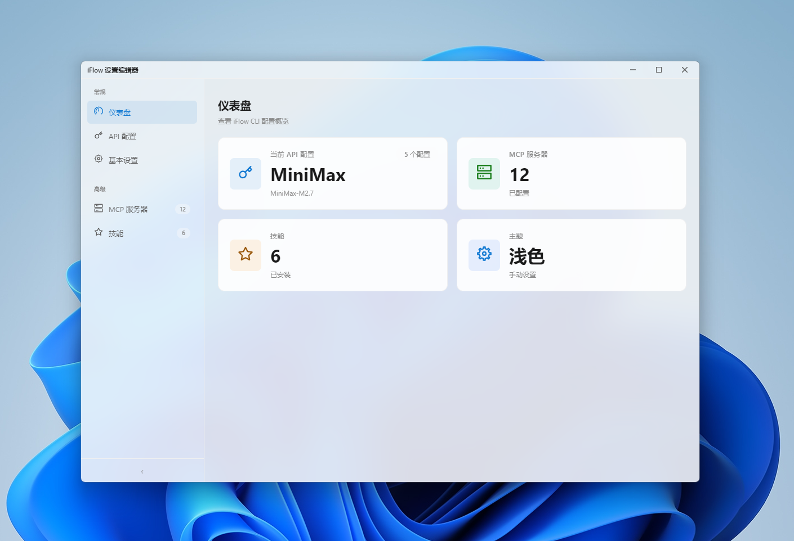
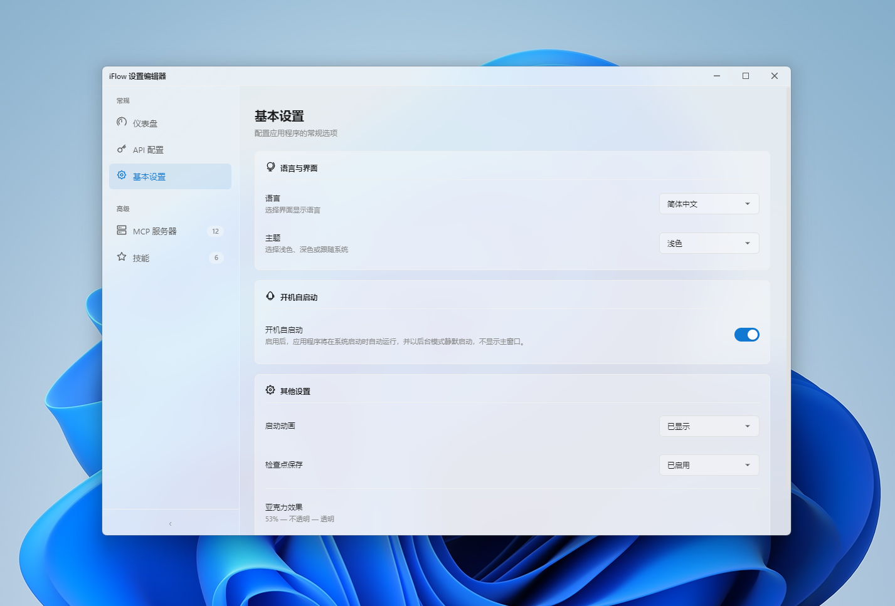
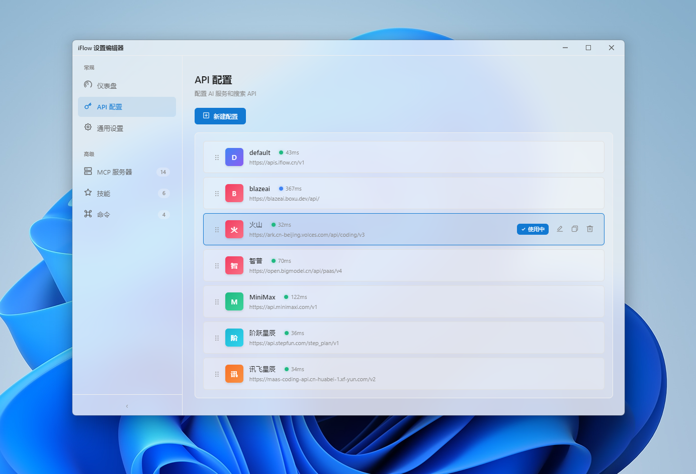
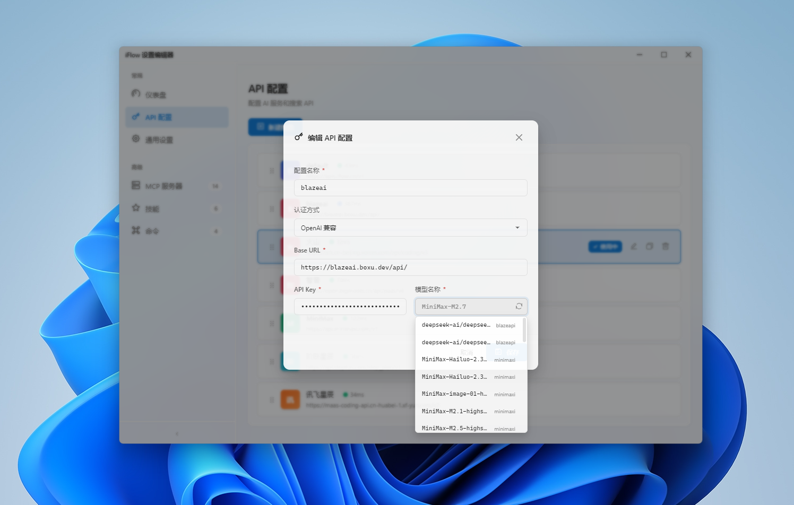
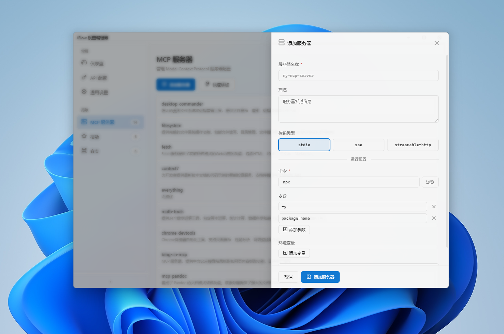
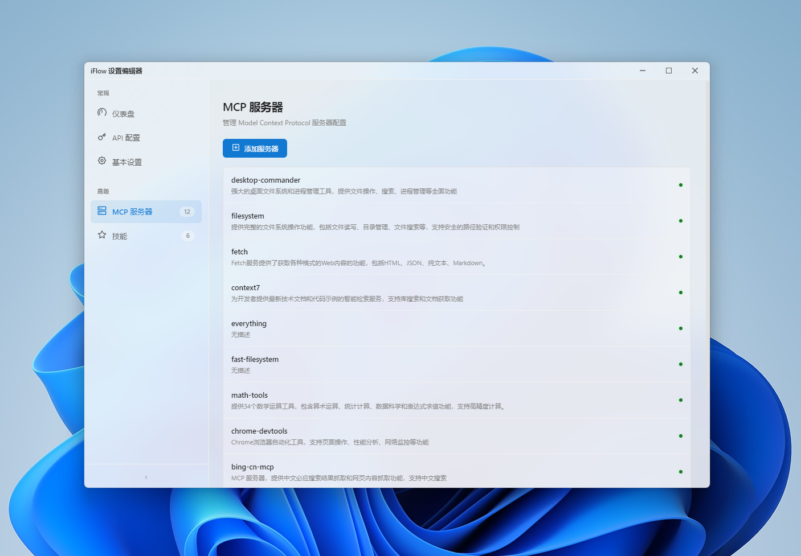
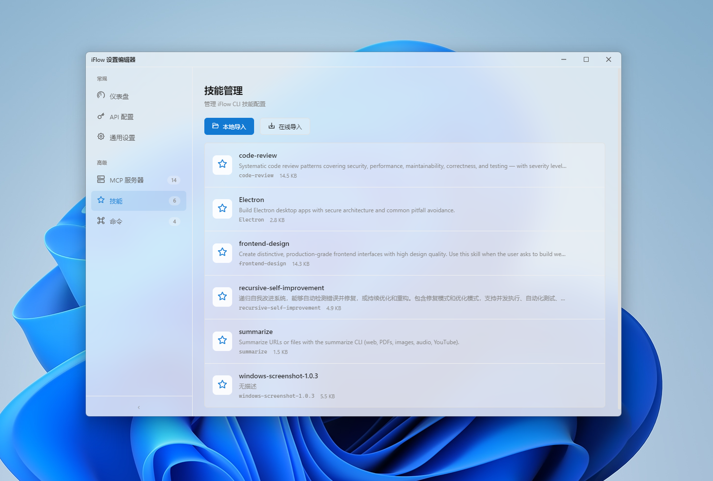
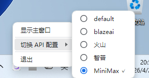

# iFlow Settings Editor

一个用于编辑 iFlow CLI 配置文件的桌面应用程序。



## 功能特性

- 📝 **API 配置管理** - 支持多环境配置文件切换、创建、编辑、重命名、复制、删除和拖动排序
- 🔄 **自动更新检查** - 启动时自动检查更新，支持手动检查，下载进度实时显示，可随时取消
- 📥 **后台下载支持** - 更新可在后台静默下载，进度在设置页面实时显示，完成后一键安装
- 🖥️ **MCP 服务器管理** - 便捷的 Model Context Protocol 服务器配置界面
- ⚡ **Commands 命令管理** - 可视化管理 iFlow 命令，支持查看、执行和命令配置
- 🎨 **Windows 11 设计风格** - 采用 Fluent Design 设计规范
- 🌈 **多主题支持** - Light / Dark / System (跟随系统) 三种主题
- 🌍 **国际化** - 支持简体中文、English、日語
- 💧 **亚克力效果** - 可调节透明度的现代视觉效果
- 🧩 **技能管理** - 本地和在线导入、导出、删除 iFlow 技能
- 📦 **系统托盘** - 最小化到托盘，快速切换 API 配置
- 🚀 **开机自启动** - 支持开机自动启动，可选后台静默启动
- 📊 **仪表盘视图** - 直观展示当前配置状态和快捷操作

## 技术栈

| 技术 | 版本 |
|------|------|
| Electron | 28.x |
| Vue | 3.4.x |
| Vite | 8.x |
| vue-i18n | 9.x |
| Less | 4.x |
| Vitest | 4.x |
| electron-builder | 24.x |
| @icon-park/vue-next | 1.4.x |

## 支持的系统

- Windows 10 / 11 (x64)
- macOS 12+ (x64 / arm64)

## 安装

### 从源码运行

```bash
# 克隆项目
git clone https://git.pandorastudio.cn/product/iFlow-Settings-Editor-GUI.git

# 进入目录
cd iFlow-Settings-Editor-GUI

# 安装依赖
npm install

# 开发模式运行
npm run electron:dev
```

### 构建安装包

```bash
# 构建 Windows 安装包 (x64)
npm run build:win

# 构建便携版
npm run build:win-portable

# 构建 NSIS 安装程序
npm run build:win-installer

# 构建 macOS 安装包 (x64 + arm64)
npm run build:mac

# 构建 macOS 指定架构
npm run build:mac64   # 仅 x64
npm run build:mac-arm # 仅 arm64

# 构建 macOS DMG 安装包
npm run build:mac-dmg

# 构建 macOS ZIP 压缩包
npm run build:mac-zip
```

构建完成后，安装包位于 `release/` 目录下。

### CI/CD

项目使用 GitHub Actions 进行持续集成和发布：

- **推送标签** `v*` 自动构建并创建 GitHub Release
- 支持 Windows (x64) 和 macOS (x64/arm64) 多平台构建
- 自动提取 CHANGELOG.md 生成发布说明

```bash
# 触发发布
git tag v1.9.0
git push origin v1.9.0
```

## 使用说明

### 基础设置



在「常规」页面可以设置：

- **语言** - 界面显示语言
- **主题** - 视觉主题风格
- **启动动画** - 控制应用启动时的动画显示
- **检查点保存** - 开启/关闭自动保存功能
- **亚克力效果** - 调节窗口背景透明度
- **手动检查更新** - 点击「检查更新」按钮手动检测新版本，下载进度实时显示，支持取消下载

### API 配置管理



在「API 配置」页面可以：

- **切换配置** - 点击不同配置文件快速切换
- **新建配置** - 创建新的 API 环境配置
  
- **编辑配置** - 修改现有配置的名称、认证方式、API Key、Base URL 等
- **重命名配置** - 为配置设置新名称（当前使用中的配置不可重命名）
- **复制配置** - 复制现有配置创建新配置
- **拖动排序** - 拖动配置文件调整显示顺序
- **删除配置** - 删除不需要的配置（默认配置不可删除）

支持的认证方式：
- API Key
- OpenAI 兼容

### MCP 服务器管理




在「MCP 服务器」页面可以：

- **添加服务器** - 配置新的 MCP 服务器
- **编辑服务器** - 修改服务器的命令、工作目录、参数等
- **删除服务器** - 移除不需要的服务器

### 技能管理



在「技能」页面可以：

- **本地导入** - 从本地 ZIP 压缩包导入技能
- **在线导入** - 从 GitHub URL 导入技能
- **导出技能** - 将技能导出到指定目录
- **删除技能** - 移除不需要的技能

### Commands 命令管理

在「Commands」页面可以：

- **命令列表** - 查看所有可用的 iFlow 命令
- **执行命令** - 快速执行常用命令
- **命令配置** - 管理命令参数和选项

### 系统托盘



- 关闭窗口时，应用会最小化到系统托盘
- 双击托盘图标可重新显示主窗口
- 右键托盘菜单可快速切换 API 配置

## 配置文件

应用配置文件位于：

```
~/.iflow/settings.json
```

每次保存时会自动生成备份文件 `settings.json.bak`。

## 测试

```bash
# 运行测试
npm run test

# UI 模式测试
npm run test:ui

# 测试覆盖率
npm run test:coverage

# 单次运行测试
npm run test:run
```

## 项目结构

```
iFlow-Settings-Editor-GUI/
├── main.js              # Electron 主进程
├── preload.js           # 预加载脚本
├── index.html           # 入口 HTML
├── vite.config.js       # Vite 配置
├── vitest.config.js     # Vitest 测试配置
├── build/               # 构建资源
├── dist/                # Vite 构建输出
├── release/             # Electron Builder 输出
├── screenshots/         # 应用截图
└── src/
    ├── main.js          # Vue 入口
    ├── App.vue          # 根组件
    ├── components/      # 公共组件
    │   ├── TitleBar.vue        # 标题栏
    │   ├── SideBar.vue         # 侧边导航
    │   ├── InputDialog.vue     # 输入对话框
    │   ├── MessageDialog.vue   # 消息对话框
    │   ├── ApiProfileDialog.vue # API 配置弹窗
    │   ├── ServerPanel.vue     # 服务器编辑面板
    │   └── CommandEditorDialog.vue # 命令编辑对话框
    ├── views/           # 页面视图
    │   ├── GeneralSettings.vue # 常规设置
    │   ├── ApiConfig.vue      # API 配置管理
    │   ├── McpServers.vue     # MCP 服务器管理
    │   ├── SkillsView.vue     # 技能管理
    │   ├── CommandsView.vue   # 命令管理
    │   └── Dashboard.vue     # 仪表盘
    ├── locales/         # 国际化语言包
    └── styles/          # 全局样式
```

## 许可证

MIT License

## 联系方式

- 公司: 上海潘哆呐科技有限公司
- 项目地址: https://git.pandorastudio.cn/product/iFlow-Settings-Editor-GUI
