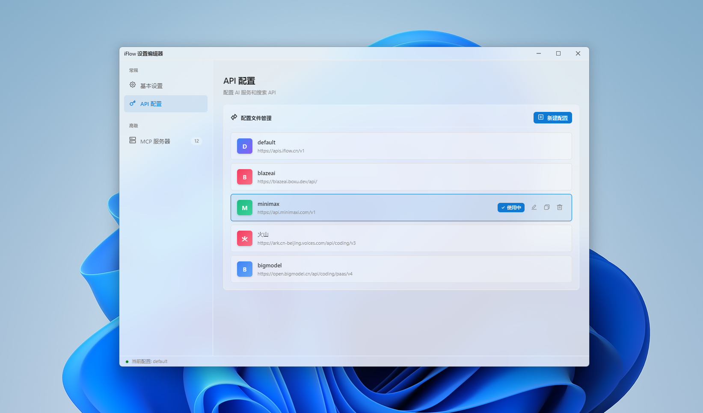

# iFlow Settings Editor

一个用于编辑 iFlow CLI 配置文件的桌面应用程序。



## 功能特性

- 📝 **API 配置管理** - 支持多环境配置文件切换、创建、编辑、复制和删除
- 🖥️ **MCP 服务器管理** - 便捷的 Model Context Protocol 服务器配置界面
- 🎨 **Windows 11 设计风格** - 采用 Fluent Design 设计规范
- 🌈 **多主题支持** - Light / Dark / System (跟随系统) 三种主题
- 🌍 **国际化** - 支持简体中文、English、日語
- 💧 **亚克力效果** - 可调节透明度的现代视觉效果
- 📦 **系统托盘** - 最小化到托盘，快速切换 API 配置

## 技术栈

| 技术 | 版本 |
|------|------|
| Electron | 28.x |
| Vue | 3.4.x |
| Vite | 8.x |
| vue-i18n | 9.x |
| Less | 4.x |
| Vitest | 4.x |

## 支持的系统

- Windows 10 / 11 (x64)

## 安装

### 从源码运行

```bash
# 克隆项目
git clone https://git.pandorastudio.cn/product/iFlow-Settings-Editor-GUI.git

# 进入目录
cd iFlow-Settings-Editor-GUI

# 安装依赖
npm install

# 开发模式运行
npm run electron:dev
```

### 构建安装包

```bash
# 构建 Windows 安装包 (x64)
npm run build:win

# 构建便携版
npm run build:win-portable

# 构建 NSIS 安装程序
npm run build:win-installer
```

构建完成后，安装包位于 `release/` 目录下。

## 使用说明

### 基础设置

在「常规」页面可以设置：

- **语言** - 界面显示语言
- **主题** - 视觉主题风格
- **启动动画** - 控制应用启动时的动画显示
- **检查点保存** - 开启/关闭自动保存功能
- **亚克力效果** - 调节窗口背景透明度

### API 配置管理

在「API 配置」页面可以：

- **切换配置** - 点击不同配置文件快速切换
- **新建配置** - 创建新的 API 环境配置
- **编辑配置** - 修改现有配置的认证方式、API Key、Base URL 等
- **复制配置** - 复制现有配置创建新配置
- **删除配置** - 删除不需要的配置（默认配置不可删除）

支持的认证方式：
- iFlow
- API Key
- OpenAI 兼容

### MCP 服务器管理

在「MCP 服务器」页面可以：

- **添加服务器** - 配置新的 MCP 服务器
- **编辑服务器** - 修改服务器的命令、工作目录、参数等
- **删除服务器** - 移除不需要的服务器

### 系统托盘

- 关闭窗口时，应用会最小化到系统托盘
- 双击托盘图标可重新显示主窗口
- 右键托盘菜单可快速切换 API 配置

## 配置文件

应用配置文件位于：

```
~/.iflow/settings.json
```

每次保存时会自动生成备份文件 `settings.json.bak`。

## 测试

```bash
# 运行测试
npm run test

# UI 模式测试
npm run test:ui

# 测试覆盖率
npm run test:coverage

# 单次运行测试
npm run test:run
```

## 项目结构

```
iFlow-Settings-Editor-GUI/
├── main.js              # Electron 主进程
├── preload.js           # 预加载脚本
├── index.html           # 入口 HTML
├── vite.config.js       # Vite 配置
├── vitest.config.js     # Vitest 测试配置
├── build/               # 构建资源
├── dist/                # Vite 构建输出
├── release/             # Electron Builder 输出
├── screenshots/         # 应用截图
└── src/
    ├── main.js          # Vue 入口
    ├── App.vue          # 根组件
    ├── components/      # 公共组件
    ├── views/           # 页面视图
    ├── locales/         # 国际化语言包
    └── styles/          # 全局样式
```

## 许可证

MIT License

## 联系方式

- 公司: 上海潘哆呐科技有限公司
- 项目地址: https://git.pandorastudio.cn/product/iFlow-Settings-Editor-GUI
