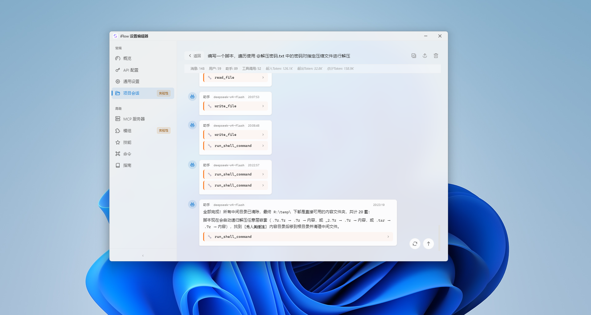

# iFlow Settings Editor

一个用于编辑 iFlow CLI 配置文件的桌面应用程序。

> 🌍 文档语言： [简体中文](./README.md) | [English](./README-en.md) | [日本語](./README-ja.md)


## 功能特性

- 📝 **API 配置管理** - 多环境配置文件切换、创建、编辑、重命名、复制、删除、拖动排序，支持列表/网格布局
- 💰 **Token 余额查询** - 支持 BUZZ / DeepSeek / 云雾等多家服务商余额自动检测，自定义供应商规则
- 🔄 **自动更新** - 启动时自动检查更新，差分更新减少下载量，后台静默下载，一键安装
- 🖥️ **MCP 服务器管理** - Model Context Protocol 服务器配置，支持 stdio/SSE/streamable-http
- ⚡ **命令管理** - 可视化管理 iFlow 命令，创建、编辑、删除、导入/导出、按类别筛选
- 🧩 **技能管理** - 本地和在线导入/导出/删除 iFlow 技能
- 🧱 **iFlow Mod 管理** - 实验性模组管理，支持 replace/append/prepend/diff 类型，冲突检测
- 🎨 **Windows 11 Fluent Design** - 亚克力效果，深色/浅色/跟随系统三种主题
- 🌍 **国际化** - 简体中文 / English / 日本語
- 📊 **仪表盘** - 概览统计、模型使用趋势图表、快捷操作入口
- ☁️ **云同步** - WebDAV 云端同步，端到端加密，多设备无缝同步
- 🚀 **开机自启动** - 支持静默后台启动（不显示窗口）
- 🔧 **界面缩放** - 75%-125% UI 缩放适配不同分辨率
- 📖 **内置文档** - 快速入门、配置说明、使用示例、功能特性
- 💬 **项目会话管理** - 查看 iFlow 会话历史、搜索、导出、Token 用量统计

## 技术栈

| 技术 | 版本 |
|------|------|
| Electron | 28.0.0 |
| Vue 3 | 3.4.0 |
| Vite | 8.0.8 |
| Pinia | 3.0.4 |
| TypeScript | 6.0.3 |
| vue-i18n | 11.4.5 |
| Less | 4.6.4 |
| Vitest | 4.1.4 |
| electron-builder | 24.13.3 |
| electron-updater | 6.8.3 |
| dompurify | 3.4.8 |
| vue-draggable-plus | 0.6.1 |

## 支持的系统

- Windows 10 / 11 (x64)
- macOS 12+ (x64 / arm64)

## 安装

### 从源码运行

```bash
# 克隆项目
git clone https://github.com/yuentao/iFlow-Settings-Editor-GUI.git

# 进入目录
cd iFlow-Settings-Editor-GUI

# 安装依赖
npm install

# 开发模式运行
npm run electron:dev
```

### 构建安装包

```bash
# 构建 Windows 安装包 (x64)
npm run build:win

# 构建便携版
npm run build:win-portable

# 构建 macOS 安装包 (x64 + arm64)
npm run build:mac
```

构建完成后，安装包位于 `release/` 目录下。

### 开发命令

```bash
# Electron 开发模式 (并行 Vite + Electron)
npm run electron:dev

# TypeScript 类型检查
npm run type-check

# ESLint 检查
npm run lint

# Prettier 格式化
npm run format

# 全面检查 (类型检查 + ESLint)
npm run check

# 运行测试
npm run test:run
```

## 使用说明

### 通用设置


在「通用设置」页面可以配置：

**偏好设置**
- **语言** - 简体中文 / English / 日本語
- **主题** - Light / Dark / System（跟随系统）
- **显示内存使用** - 在标题栏显示内存占用
- **隐藏横幅** - 隐藏 CLI 启动时的欢迎横幅
- **亚克力效果** - 调节窗口背景透明度（0-100%）
- **界面缩放** - 75%-125% UI 缩放适配不同分辨率

**CLI 行为控制**
- **最大会话轮次** - 限制对话最大轮次
- **Token 限制** - 单次请求 token 上限
- **压缩 Token 阈值** - 触发自动压缩的 token 比例
- **Shell 超时** - 命令执行超时（秒）
- **审批模式** - yolo/plan/autoEdit/default
- **启用思维链模式** - 开启 AI 深度思考
- **排除工具** - 指定不加载的工具列表
- **日志级别** - info / debug / silent
- **自动更新** - 开/关自动更新检查

**云同步**
- WebDAV 云同步配置，端到端加密

**关于**
- 版本信息、检查更新、更新历史

### API 配置管理


在「API 配置」页面可以：

- **切换配置** - 点击不同配置文件快速切换
- **新建配置** - 创建新的 API 环境配置
- **编辑配置** - 修改认证方式、API Key、Base URL、模型名称、Token 限制、过期天数等；支持从 API 自动获取可用模型列表和余额查询
- **布局切换** - 列表/网格两种布局模式，网格模式下支持拖拽排序
- **Token 余额** - 自动检测并显示供应商余额（支持 BUZZ/DeepSeek/云雾及自定义规则）
- **连通性监控** - 实时检测 API 延迟，状态指示器显示


支持的认证方式：
- API Key
- OpenAI 兼容

### MCP 服务器管理


在「MCP 服务器」页面可以：

- **添加服务器** - 配置新的 MCP 服务器（stdio/sse/streamable-http）
- **编辑服务器** - 修改名称、描述、命令、参数、环境变量
- **快速添加** - 粘贴 JSON/命令行/URL 批量添加，自动解析并去重
- **分享配置** - 导出分享 MCP 服务器配置，方便团队复用

### 技能管理


- **本地导入** - 从 ZIP 压缩包导入技能
- **在线导入** - 从 GitHub URL 导入技能
- **导出技能** - 导出到指定目录
- **删除技能** - 移除不需要的技能

### 命令管理


- 创建、编辑、删除自定义命令
- 支持按类别筛选（utility / documentation / other）
- 导出为 JSON 文件，从 JSON 文件导入
- 字段：名称、描述、类别、版本、作者、提示词

### iFlow Mod 管理


实验性功能，支持 iFlow 修饰符模块管理：
- **模组类型**：replace / append / prepend / diff
- **启用/禁用** - 灵活开关模组
- **冲突检测** - 自动检测行级冲突
- **版本兼容性** - 检查与当前 iFlow 版本的兼容性
- **导入/导出** - 本地导入导出模组
- **打包工具** - 使用 [iFlow-Mod-Builder](https://github.com/yuentao/iFlow-Mod-Builder) 图形化打包生成 `.iflow-mod` 文件

### 项目会话管理


查看 iFlow 项目与会话历史：
- **项目列表** - 显示所有项目，会话数量和最后活动时间
- **会话详情** - 消息内容、统计信息（Token 消耗、工具调用数等）
- **搜索会话** - 按关键字搜索
- **导出** - Markdown / JSON 格式导出
- **Token 用量统计** - 详细的 Token 消耗分析



### 文档查看器


内置帮助文档系统：
- **快速入门** - 新用户指南
- **配置说明** - settings.json 详解
- **使用示例** - hooks、MCP、命令、计划模式等

### 云同步


WebDAV 协议跨设备配置同步：
- 端到端加密，增量合并，字段级冲突处理
- 设备管理、密码保护、删除记录保留期
- 自动/手动同步，仅拉取/仅推送

### 系统托盘


- 关闭窗口隐藏到托盘
- 双击托盘图标显示主窗口
- 右键菜单快速切换 API 配置

## 配置文件

应用配置文件位于：

```
~/.iflow/settings.json
```

每次保存时自动生成备份文件 `settings.json.bak`。

## 测试

```bash
# 运行测试（监听模式）
npm run test

# UI 模式
npm run test:ui

# 覆盖率报告
npm run test:coverage

# 单次运行
npm run test:run
```

## 项目结构

```
iFlow-Settings-Editor-GUI/
├── main.js              # Electron 主进程入口
├── preload.js           # 预加载脚本
├── index.html           # 入口 HTML
├── vite.config.js       # Vite 配置
├── package.json         # 项目配置
├── screenshots/         # 应用截图
└── src/
    ├── main.js          # Vue 入口
    ├── App.vue          # 根组件（懒加载视图）
    ├── components/      # 公共组件（20+ 个）
    ├── composables/     # 组合式函数
    ├── views/           # 页面视图（10 个）
    ├── stores/          # Pinia 状态管理（3 个 store）
    ├── locales/         # 国际化语言包（3 种语言）
    ├── styles/          # 全局样式
    ├── shared/          # 共享类型定义
    ├── workers/         # Web Worker 线程
    └── main/            # Electron 主进程
        ├── index.js     # 入口
        ├── ipc/         # IPC 处理器（10 个模块）
        ├── services/    # 业务逻辑（6 个服务）
        ├── crypto/      # 加密模块
        ├── workers/     # Worker 管理器
        └── utils/       # 工具函数
```

## 许可证

MIT License

## 联系方式

- 公司：上海潘哆呐科技有限公司
- 项目地址：https://github.com/yuentao/iFlow-Settings-Editor-GUI
